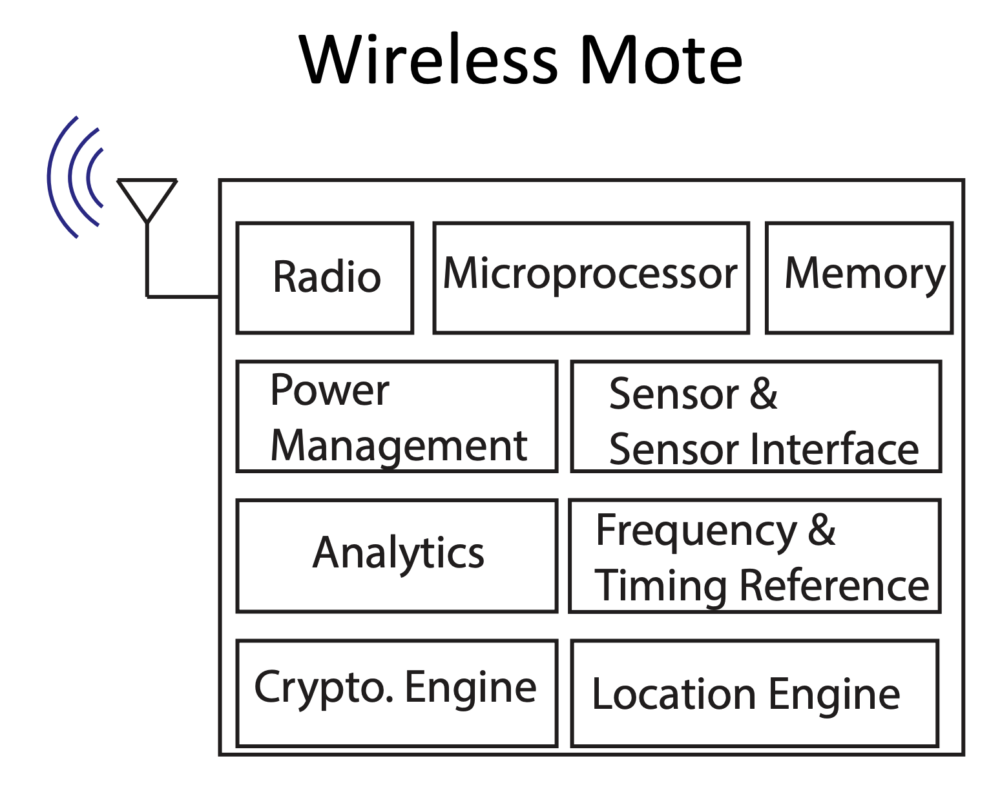
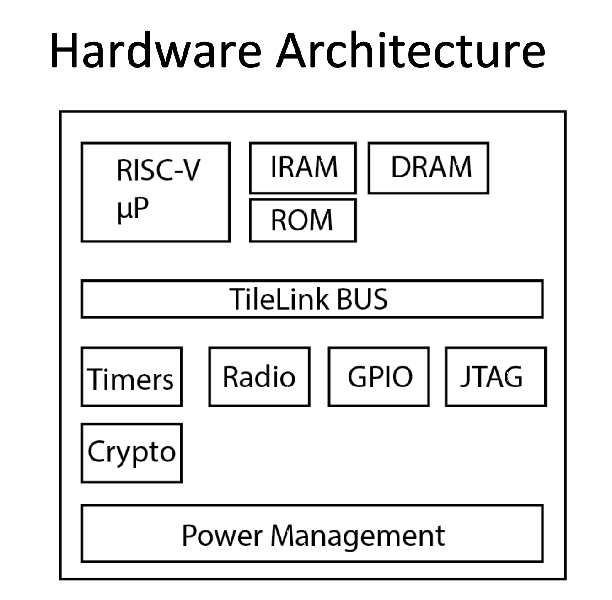

# EE290C Student Background & Interests Poll 

This course will be pretty different from most others you've taken. 
We'll all be doing one big project together - designing and taping out our SoC. 
It's a lot of work, and will require everyone working together. 
This means not everyone will be doing the same work. 
(In fact, if we're doing it right, everyone should be doing *different* work from everyone else.) 

Designing a chip requires a bunch of diverse design-activities, requiring different backgrounds and tools. 
One material example will be the divide between the digital and analog/RF parts of our chip. 

This initial survey is our starting-point for divying up that work. 
It'll focus on your interests and goals for taking the course. 
Don't take it like an exam. It's not. 
Be honest about what you know, how well, and what you'd like to further dig into. 

--- 
## Section 1 

Figures 1 and 2 above are high-level block diagrams of past EE290C chips. 
This chip is designed for low-power wireless robotics. It primarily consists of: 

* A small microprocessor - in our case a RISC-V RV32 core 
* A wireless transceiver 
* The associated baseband logic which gets data between the CPU and RF 
* Handfuls of (primarily analog) miscellaneous and housekeeping circuits, such as power management and biasing

Questions: 

* Do you think you own or use any other chips like this? In what sorts of products? 
* Which parts of this look like something you would want to work on? 
* Which parts look like something you've worked on in prior projects or courses? How similar? 

## Section 2 

* Which prior courses (if any) have you taken on digital circuits? 
* What's the biggest/ most complicated thing you designed, either in these courses or in related projects? 
* What part of that work was *yours* - you owned it, and really deeply know how it works?
* Would you call yourself an expert with, user of, or aware of: 
  * (a) Either of the popular digital HDLs (Verilog, VHDL) 
  * (b) Berkeley's home-grown HDL, Chisel

## Section 3 

* Which prior courses (if any) have you taken on analog & RF circuits? 
* What's the biggest/ most complicated thing you designed, either in these courses or in related projects? 
* What part of that work was *yours* - you owned it, and really deeply know how it works?
* Would you call yourself an expert with, user of, or aware of: 
  * (a) Cadence's popular analog-chip design tools
  * (b) Berkeley's home-grown Analog Generator tools (BAG)

## Section 4 

* Which degree are you pursuing, and which year are you in? 
* What made you decide to take this course? 
* Ideally, what would you like to get out of the course?

