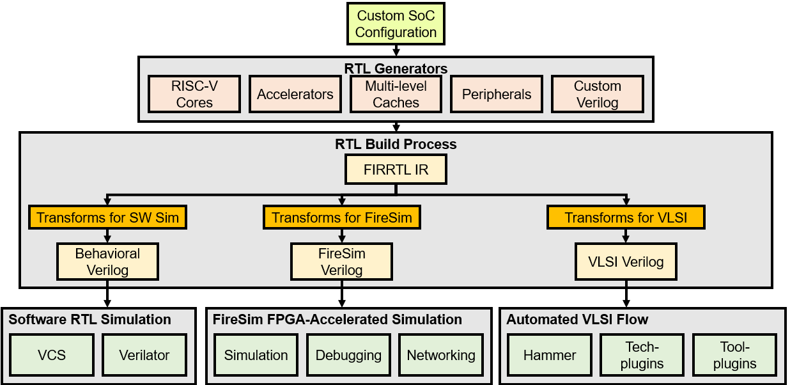
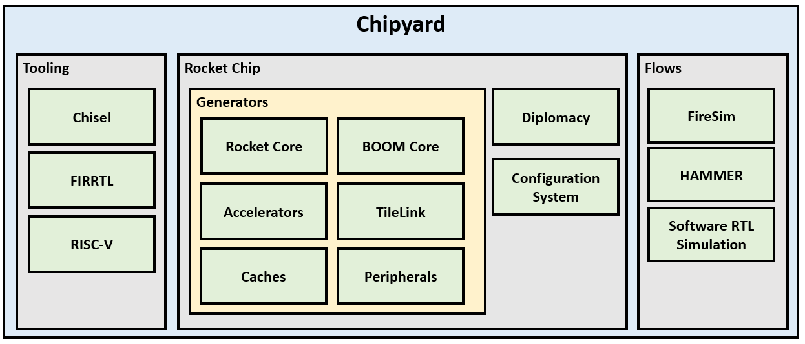
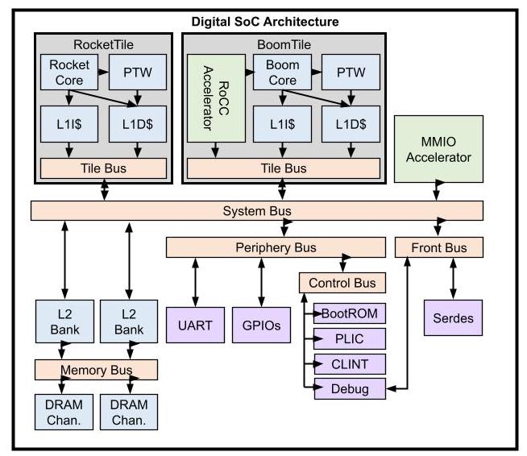
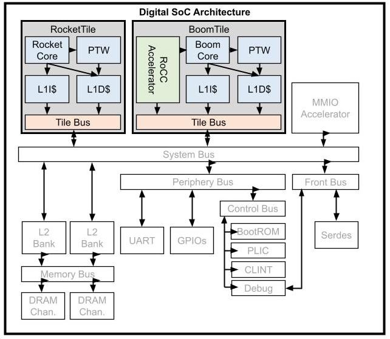
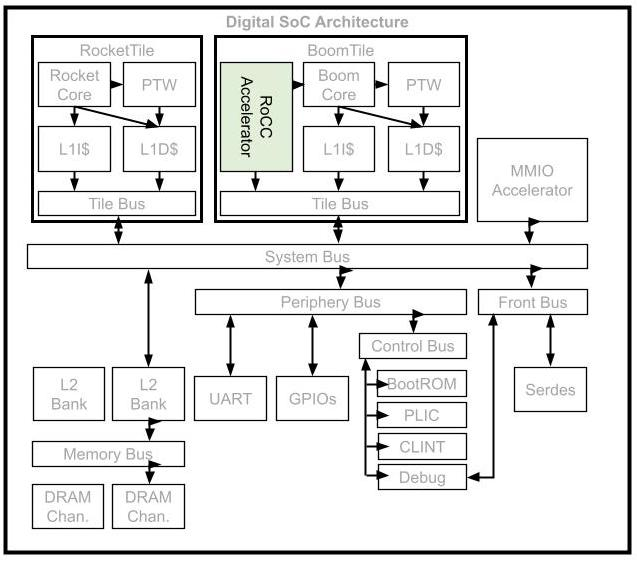
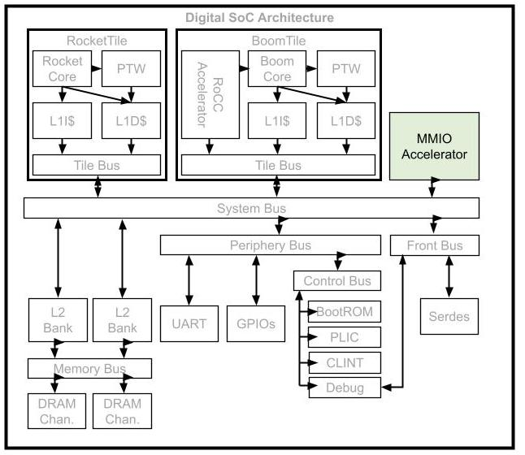
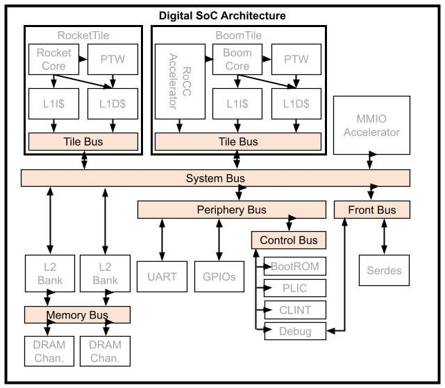
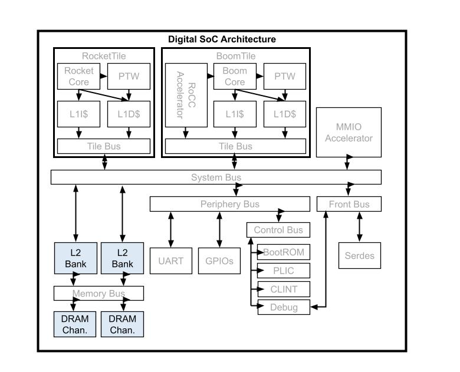
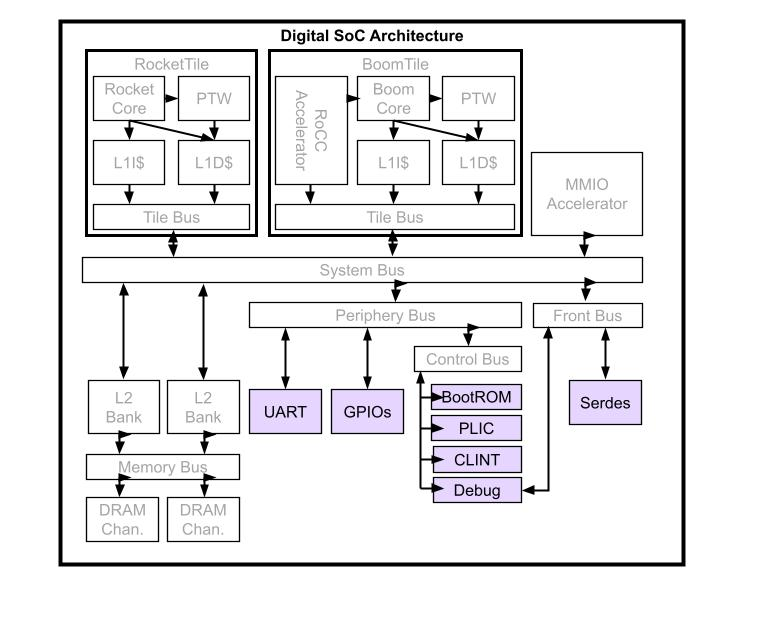
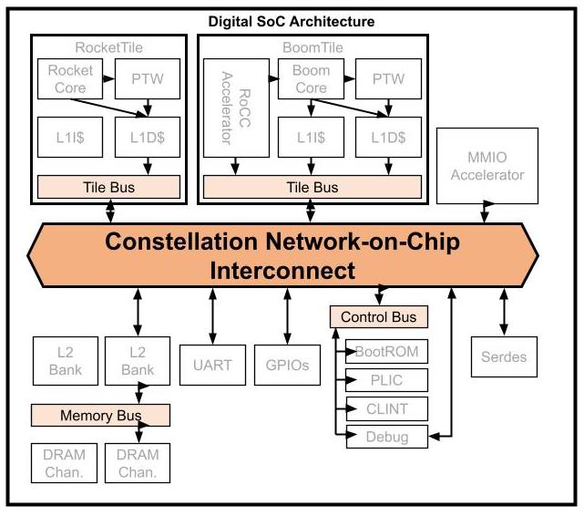

# Chipyard 

## Tutorial & Lab

BWRC & Intel 22nm Edition

## Overview



In this lab, we will explore the [Chipyard](https://github.com/ucb-bar/chipyard) framework. 
Chipyard is an integrated design, simulation, and implementation framework for open source hardware development developed here at UC Berkeley. 
Chipyard is open-sourced online and is based on the Chisel and FIRRTL hardware description libraries, as well as the Rocket Chip SoC generation ecosystem.
Chipyard brings together much of the work on hardware design methodology from Berkeley over the last decade as well as useful tools into a single repository that guarantees version compatibility between the projects it submodules.

A designer can use Chipyard to build, test, and tapeout (manufacture) a RISC-V-based SoC.
This includes RTL development integrated with Rocket Chip, cloud FPGA-accelerated simulation with FireSim, and physical design with the Hammer framework.
Information about Chisel can be found in [https://www.chisel-lang.org/](https://www.chisel-lang.org/).

# TODO
While you will not be required to write any Chisel code in this lab, basic familiarity with the language will be helpful in understanding many of the components in the system and how they are put together.

<!-- An initial introduction to Chisel can be found in the Chisel bootcamp:  [https://github.com/freechipsproject/chisel-bootcamp](https://github.com/freechipsproject/chisel-bootcamp).  -->
<!-- Detailed documentation of Chisel functions can be found in [https://www.chisel-lang.org/api/SNAPSHOT/index.html](https://www.chisel-lang.org/api/SNAPSHOT/index.html). -->

Throughout the rest of the course, we will be developing our SoC using Chipyard as the base framework. 
There is a lot in Chipyard so we will only be able to explore a part of it in this lab, but hopefully you will get a brief sense of its capabilities.
We will simulate a Rocket Chip-based design at the RTL level, and then synthesize and place-and-route it in ~Intel 22nm~ technology using the Hammer back-end flow.



# TODO - edit this to separate lab from the rest of the class
## Access & Setup

It should be clear by now this isn't going like most other courses. Most don't require signing non-disclosure agreements, or setting up a long string of IT infrastructure. Such is chip-design life. Running the Intel22 ChipYard lab will require access to a handful of BWRC research resources, including:

* Command-line access to the BWRC Linux servers
* Membership in the BWRC Linux `intech22` group
* The BWRC-Repo GitLab instance at [https://bwrcrepo.eecs.berkeley.edu](https://bwrcrepo.eecs.berkeley.edu)
* The course group in said GitLab instance, at [https://bwrcrepo.eecs.berkeley.edu/EE290C_EE194_intech22](https://bwrcrepo.eecs.berkeley.edu/EE290C_EE194_intech22)
* The corresponding Intel22 technology group at [https://bwrcrepo.eecs.berkeley.edu/intech22](https://bwrcrepo.eecs.berkeley.edu/intech22)

If you don't have access to any of these, this isn't going to work yet. As of this lab's writing most student setup is in progress; if yours doesn't work yet, take a minute to bug your peers about whether theirs does, and perhaps bug your instructors or admins for good measure. 

This lab also presumes much of its GitLab interaction will occur via SSH. While setting up git to use HTTPS instead is possible by editing several lab materials, we recommend instead setting up [SSH keys](https://bwrcrepo.eecs.berkeley.edu/profile/keys) on the BWRC-Repo GitLab instance. 

## Getting Started

First, we will need to setup our Chipyard workspace.  
All of our work will occur on the BWRC compute cluster. 
For this lab, please work in the `/tools/C/` directory on the machine. 
This lab will likely generate too much data for it to fit in your home directory. 
All required materials are stored in the [BWRC-Repo GitLab instance](https://bwrcrepo.eecs.berkeley.edu).


First source the following environment file. This will add pre-compiled binaries of all the RISC-V tools to your PATH.

```
source /tools/C/ee290/env-riscv-tools.sh
```


Run the commands below. These commands clone the Chipyard repository, then initialize all the submodules.

```
mkdir -p /tools/C/userName/intech22
cd /tools/C/userName/intech22
git clone git@bwrcrepo.eecs.berkeley.edu:EE290C_EE194_intech22/chipyard-lab.git chipyard
cd chipyard
./scripts/init-submodules-no-riscv-tools.sh
```

## Chipyard Repo Tour

```
 chipyard/
  generators/ <------- library of Chisel generators
    chipyard/
    sha3/
  sims/         <----- utilities for simulating SoCs
    verilator/
    firesim/
  fpga/
  software/
  vlsi/ <------------- HAMMER VLSI Flow
  toolchains/ <------- RISC-V Toolchain
```

You may have noticed while initializing your Chipyard repo that there are many submodules.  
Chipyard is built to allow the designer to generate complex configurations from different projects 
including the in-order Rocket Chip core, the out-of-order BOOM core, the systolic array Gemmini, and many other components needed to build a chip.
Thankfully, Chipyard has some great documentation, which can be found 
[here](https://chipyard.readthedocs.io/en/latest/). 

You can find most of these in the `chipyard/generators/` directory.
All of these modules are built as generators (a core driving point of using Chisel), which means that each piece is parameterized and can be fit together with some of the functionality in Rocket Chip (check out the TileLink and Diplomacy references in the Chipyard documentation).

# TODO mark what part of the overview image this is
### SoC Architecture 
<p align="center">
  
</p>


<script src="https://cdn.mathjax.org/mathjax/latest/MathJax.js?config=TeX-AMS-MML_HTMLorMML" type="text/javascript"></script>
<table border="0">
 <tr>
    <td></td>
    <td>
      <h2>Tiles:</h2>
      <ul>
        <li> Each Tile contains a RISC-V core and private caches (specified through configs)
        <li> Several varieties of Cores supported
        <li> Interface supports integrating your own RISC-V core implementation
      </ul>
    </td>
 </tr>
</table>


<br /> 
<br /> 
<br /> 
<br />



#### RoCC Accelerators:
- Tightly-coupled accelerator interface
- Attach custom accelerators to Rocket or BOOM cores
- More on this later

<br /> 
<br /> 
<br /> 
<br /> 




#### MMIO Accelerators:
- Controlled by MMIO-mapped registers
- Supports DMA to memory system
- Examples: Nvidia NVDLA accelerator & FFT accelerator generator (we should link these)
- More on this later

<br /> 
<br /> 
<br /> 
<br /> 



#### TileLink Standard:
- TileLink is open-source chip-scale interconnect standard
- Comparable to AXI/ACE
- Supports multi-core, accelerators, peripherals, DMA, etc

#### Interconnect IP:
- Library of TileLink RTL generators provided in RocketChip
- RTL generators for crossbar-based buses
- Width-adapters, clock-crossings, etc.
- Adapters to AXI4, APB



##### Shared memory:
- Open-source TileLink L2 developed by SiFive
- Directory-based coherence with MOESI-like protocol
- Configurable capacity/banking
- Support broadcast-based coherence in no-L2 systems
- Support incoherent memory systems
 
##### DRAM:
- AXI-4 DRAM interface to external memory controller
- Interfaces with DRAMSim/FASED

<br /> 
<br /> 
<br /> 
<br /> 



##### Peripherals and IO:
- Open-source RocketChip + SiFive blocks:
  - Interrupt controllers
  - JTAG, Debug module, BootROM
  - UART, GPIOs, SPI, I2C, PWM, etc.
- TestChipIP: useful IP for test chips
  - Clock-management devices
  - SerDes
  - Scratchpads


<p align="center">
  
</p>

##### Constellation
- A parameterized Chisel generator for SoC interconnects
- Protocol-independent transport layer
- Supports TileLink, AXI-4
- Highly parameterized
- Deadlock-freedom
- Virtual-channel wormhole-routing

## TODO gif of slide 26 https://docs.google.com/presentation/d/1gDoLQzga65vSrr1FffLy-9yaR3zJeOVc/edit#slide=id.p26
## TODO slides 27-33

#### In summary...
- Configs: Describe parameterization of a multi-generator SoC
- Generators: Flexible, reusable library of open-source Chisel generators (and Verilog too)
- IOBinders/HarnessBinders: Enable configuring IO strategy and Harness features
- FIRRTL Passes: Structured mechanism for supporting multiple flows
- Target flows: Different use-cases for different types of users


### Config Exercise
You can find the Chipyard specific code and its configs in `chipyard/generators/chipyard/src/main/scala/config`.
You can look at examples of how your own Chisel modules or verilog black-box modules can be integrated into a Rocket Chip-based SoC in `chipyard/generators/chipyard/src/main/scala/example`.
### Running Some Commands


## MMIO Design

Many times, an accelerator block is connected to the Rocket core with a memory-mapped interface over the system bus. 
This allows the core to configure and read from the block.

## Rocc Design


## Chipyard Simulation and Design Benchmarking

### RTL Simulation

Many Chipyard Chisel-based design looks something like a Rocket core connected to some kind of "accelerator" (eg. a DSP block like an FFT module).
When building something like that, you would typically build your "accelerator" generator in Chisel, and unit test it using ChiselTesters.
You can then write integration tests (eg. a baremetal C program) which can then be simulated with your Rocket Chip and "accelerator" block together to test end-to-end system functionality. 
Chipyard provides the infrastructure to help you do this for both VCS (Synopsys) and Verilator (open-source).
In this lab, we are just focusing on a Rocket core in isolation, so we will run some assembly tests on a Rocket config.
You can edit the configs being used through overriding the make invocation with 
`CONFIG=YourConfig`.
We'll start by building and simulating the default ChipYard configuration. 

**Note:** For running VCS simulations, we will run on a specific BWRC host machine to avoid some nasty bugs due to toolchain version incompatibilities. For all other steps our remote machine will be a bwrcrdsl machine

```
# SSH to a specific machine (bwrcr740-8)
ssh bwrcr740-8
cd /tools/C/userName/intech22/chipyard/sims/vcs
source /tools/C/ee290/env-riscv-tools.sh

# build the default configuration
make CONFIG=RocketConfig
# run the BINARY on the simulator and log instructions to a file 
make run-binary CONFIG=RocketConfig BINARY=$RISCV/riscv64-unknown-elf/share/riscv-tests/isa/rv64ui-p-simple 

# Return to bwrcrdsl
exit
```

The first command will elaborate the design and create Verilog.
This is done by converting the Chisel code, embedded in Scala, into a FIRRTL intermediate representation which is then run through the FIRRTL compiler to generate Verilog.
Next it will run VCS to build a simulator out of the generated Verilog that can run RISC-V binaries.
The second command will run the test specified by `BINARY` and output results as an `.out` file.
This file will be emitted to the `output/` directory.

**Q: 1. In your lab report, include the last 10 lines of the `.out` file generated by the assembly test you ran.  It should include the *** PASSED *** flag.**

## VLSI Flow

### Design Elaboration

The Hammer flow we have used throughout the semester is integrated into Chipyard.
A project setup similar to the ones we have previously used is in `chipyard/vlsi`.
To set up VLSI back-end design, run: 

```
cd chipyard
scripts/init-vlsi.sh intech22
cd chipyard/vlsi
source hammer/sourceme.sh
```

**Note: For all compute intensive commands in the VLSI flow (all make commands from this point forwards, as well as launching Innovus via `open_chip`), run them on the LSF.** In other words, prepend the command with

```
bsub -Is
```

To setup the Hammer back-end flow, run:

```
make CONFIG=RocketConfig TOP=RocketTile tech_name=intech22 INPUT_CONFS="rockettile.yml" buildfile
```

Lets go through the various flags in this command:

- `CONFIG` sets the system config, the same way we set the config for RTL simulation
- `TOP` specifies the name of the module which will be the "top" module in our flow. The actual "top" of a design is `ChipTop`, but for this example, we will choose the `RocketTile` sub-module to run the flow
- `tech_name` specifies the target technology. You many want to edit the default setting for this in `vlsi/Makefile`, instead of specifying it each time you run a VLSI command
- `INPUT_CONFS` specifies a list of input YAML files which specify settings for HAMMER and the VLSI tools. You may want to edit the default setting for this in `vlsi/Makefile`, instead of specifying it each time you run a VLSI command
  - `rockettile.yml` specifies design-specific settings, in this case settings for running the VLSI flow when `RocketTile` is the top module
- The`buildfile` target describes a Makefile fragment that will be used in the actual VLSI flow (syn/par/drc/lvs), which we will run next. After this command runs, the generated verilog for the design should appear in the `vlsi/generated-src` directory.

One important difference between the `make` command for the VLSI flow, compared with the `make` command for the RTL simulation flow, is that in the VLSI flow the memories in the design will be mapped to hard SRAM macros available in the Hammer technology library. In the `generated-src/chipyard.TestHarness.RocketConfig` directory, inspect the file with the `.top.mems.conf` and `.top.mems.v` extensions. These files describe the parameters of the memories in the design, as well as the actual verilog instantiations of each memory.

**Q: What is the breakdown of SRAM blocks for each of the memories in the design? (this can be found by looking at the files described above.)**

### Synthesis

Now that the design is elaborated, we can leverage the Hammer infrastructure we have used this semester to physically build our system in much the same way as before.
Our Hammer config is in `rockettile.yml`. Here you can see we have again constrained our top-level clock to be 50 MHz. It is pretty straightforward to close timing for the Rocket core in the 100's of MHz with limited physical design input using Hammer out-of-the-box, but we are running it at this lower frequency to ease our design constraints.

To run synthesis, run:

```
make CONFIG=RocketConfig TOP=RocketTile tech_name=intech22 INPUT_CONFS="rockettile.yml" syn
```

This step should take up to about 1 hour.  If you are ssh'd directly into the machine (not using X2go, etc.), you should use a utility like `tmux` to make sure that you don't lose your run if you lose your connection or log off.
When it completes, you can look at the results just like before in `syn-rundir/reports/` to confirm your design passed timing.

**Q: What is the critical path in the design after synthesis? This can be found by inspecting the timing reports in the directory described above.**


### Place-and-route

The next step is to run place-and-route on the synthesized netlist. 

```
make CONFIG=RocketConfig TOP=RocketTile tech_name=intech22 INPUT_CONFS="rockettile.yml" par
```

This step will also be pretty slow.
You can open up the final design in Innovus using `par-rundir/generated-scripts/open_chip`.

#### Floorplanning

Floorplanning is a key step to all designs and will have a huge effect on your design's QoR. Hammer's placement constraints API provides several options for controlling the floorplan. You can look in `rockettile.yml` to see how these constraints are being used.

- "placement" constraints constrain the position of an instance. For example, the constraints on the positions of the FPU and Core modules within the RocketTile. These constraints are more like guidelines to the tool, rather than restrictions
- "hardmacro" constraints constrain the position of hard macros. You can see we constrain the position of all the SRAM macros in the design
- "hierarchical" constraints are used in the Hammer hierarchical flow, where sub-modules of the design are individually place-and-routed
- "obstruciton" constraints can block placement of standard cells, routing, or power straps.

In this case, we should adjust the placement of the SRAM macros for our Rocket core's L1 caches.
In these Hammer constraints, you can see that the lower-left hand corner placement is specified (in microns) as well as the orientation (see `hammer/src/hammer-vlsi/defaults.yml` for documentation on all placement options).

Take a look at the layout, and notice where an obvious improvement in the floorplan can be made. Modify the specification in `rockettile.yml`.

After editing an input yml/json file, the Hammer Make include file will detect this and re-run the flow. This means that any change to any yml/json will rerun the entire syn-pnr flow after a change to `rockettile.yml`.

If you want to rerun only part of the flow (for example, only par), you have to use special `redo-STEP` flags and `HAMMER_EXTRA_ARGS`. This is because Hammer does not know which config options only affect place-and-route, so to be safe, the Hammer Makefile will rerun all prerequisite steps.

In our case, modifying the floorplan does not affect synthesis at all, so we can make the informed decision to avoid rerunning synthesis. Note that should always be done with great caution, as otherwise, changes in your design or config may not propagate to your time-consuming job.

To rerun only place-and-route after editing only floorplan constraints, run

```
make CONFIG=RocketConfig TOP=RocketTile tech_name=intech22 INPUT_CONFS="rockettile.yml" HAMMER_EXTRA_ARGS="-p rockettile.yml" redo-par
```

**Q: Include a picture of your design in Innovus with the top two metal layers turned off.**

**Q: Explain your modification to the provided floorplan, and show it in the layout.**

**Q: How much setup timing slack is there in the design?**

**Q: Include a picture of the clock tree debugger for your design from Innovus and comment on the balancing.**

#### Hierarchical Flows

In the actual class tapeout, and in most large tapeouts, the flow is hierarchical. Meaning that subcomponents will be place-and-routed as blocks, before the parent module places them as macros. If we were to do a two-level hierarchical flow, where the RocketTile is the only child module, the next step would be to synthesize and place-and-route the parent ChipTop module.

### DRC

Running DRC (Design rule checks) verifies that the layout emitted after place-and-route adheres to all the foundry rules, and is manufacturable.

Note: The example design is not intended to be DRC-clean.

```
make CONFIG=RocketConfig TOP=RocketTile tech_name=intech22 INPUT_CONFS="rockettile.yml" drc-block
```


### LVS

Running LVS (layout vs. schematic) verifies that the netlist in the final layout matches the expected netlist.

Note: The example design is not intended to be LVS-clean.

```
make CONFIG=RocketConfig TOP=RocketTile tech_name=intech22 INPUT_CONFS="rockettile.yml" lvs-block
```


<!-- ## Rest of the VLSI Flow -->

<!-- Running DRC and LVS is not required for this lab, but you can run them though Hammer just like before. -->
<!-- The placement of macros like SRAMs can cause considerable numbers of DRC and LVS errors if placed incorrectly and can cause considerable congestion if placed non-optimally. -->
<!-- The floorplan visualization tools in Hammer can help you root out these problems early in your design process. -->

## Conclusion

Chipyard is designed to allow you to rapidly build and integrate your design with general purpose control and compute as well as a whole host of other generators.
You can then take your design, run some RTL simulations, and then push it through the VLSI flow with the technology of your choice using Hammer.
The tools integrated with Chipyard, from how you actually build your design (eg. Chisel and generators), to how you verify and benchmark its performance, to how you physically implement it, are meant to enable higher design QoR within an agile hardware design process through increased designer productivity and faster design iteration.
We just scratched the surface in this lab, but there are always more interesting features being integrated into Chipyard.
We recommend that you continue to explore what you can build with Chipyard given this introduction!

## Acknowledgements

Thank you to the whole Chipyard dev team for figures and documentation on Chipyard, and to Daniel Grubb for authorship of the original tutorial on which this lab is based.

