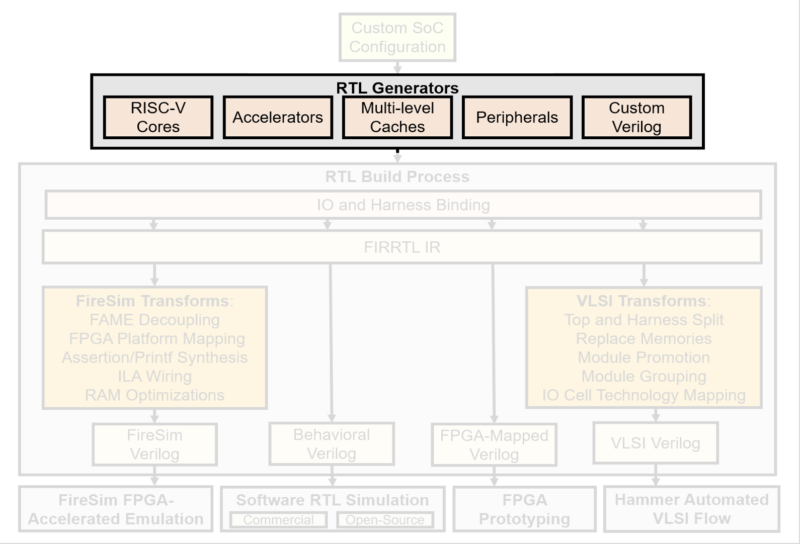

# Chipyard 

## Tutorial & Lab

BWRC & Intel 22nm Edition

## Overview


In this lab, we will explore the [Chipyard](https://github.com/ucb-bar/chipyard) framework. 
Chipyard is an integrated design, simulation, and implementation framework for open source hardware development developed here at UC Berkeley. 
Chipyard is open-sourced online and is based on the Chisel and FIRRTL hardware description libraries, as well as the Rocket Chip SoC generation ecosystem.
Chipyard brings together much of the work on hardware design methodology from Berkeley over the last decade as well as useful tools into a single repository that guarantees version compatibility between the projects it submodules.

A designer can use Chipyard to build, test, and tapeout (manufacture) a RISC-V-based SoC.
This includes RTL development integrated with Rocket Chip, cloud FPGA-accelerated simulation with FireSim, and physical design with the Hammer framework.
Information about Chisel can be found in [https://www.chisel-lang.org/](https://www.chisel-lang.org/).

# TODO - edit this to separate lab from class specifics like process tech
While you will not be required to write any Chisel code in this lab, basic familiarity with the language will be helpful in understanding many of the components in the system and how they are put together.

<!-- An initial introduction to Chisel can be found in the Chisel bootcamp:  [https://github.com/freechipsproject/chisel-bootcamp](https://github.com/freechipsproject/chisel-bootcamp).  -->
<!-- Detailed documentation of Chisel functions can be found in [https://www.chisel-lang.org/api/SNAPSHOT/index.html](https://www.chisel-lang.org/api/SNAPSHOT/index.html). -->

Throughout the rest of the course, we will be developing our SoC using Chipyard as the base framework. 
There is a lot in Chipyard so we will only be able to explore a part of it in this lab, but hopefully you will get a brief sense of its capabilities.
We will simulate a Rocket Chip-based design at the RTL level, and then synthesize and place-and-route it in ~Intel 22nm~ technology using the Hammer back-end flow.


# TODO - edit this to separate lab from class specifics like process tech
## Access & Setup

It should be clear by now this isn't going like most other courses. Most don't require signing non-disclosure agreements, or setting up a long string of IT infrastructure. Such is chip-design life. Running the Intel22 ChipYard lab will require access to a handful of BWRC research resources, including:

* Command-line access to the BWRC Linux servers
* Membership in the BWRC Linux `intech22` group
* The BWRC-Repo GitLab instance at [https://bwrcrepo.eecs.berkeley.edu](https://bwrcrepo.eecs.berkeley.edu)
* The course group in said GitLab instance, at [https://bwrcrepo.eecs.berkeley.edu/EE290C_EE194_intech22](https://bwrcrepo.eecs.berkeley.edu/EE290C_EE194_intech22)
* The corresponding Intel22 technology group at [https://bwrcrepo.eecs.berkeley.edu/intech22](https://bwrcrepo.eecs.berkeley.edu/intech22)

If you don't have access to any of these, this isn't going to work yet. As of this lab's writing most student setup is in progress; if yours doesn't work yet, take a minute to bug your peers about whether theirs does, and perhaps bug your instructors or admins for good measure. 

This lab also presumes much of its GitLab interaction will occur via SSH. While setting up git to use HTTPS instead is possible by editing several lab materials, we recommend instead setting up [SSH keys](https://bwrcrepo.eecs.berkeley.edu/profile/keys) on the BWRC-Repo GitLab instance. 

## Getting Started

First, we will need to setup our Chipyard workspace.  
All of our work will occur on the BWRC compute cluster. 
For this lab, please work in the `/tools/C/` directory on the machine. 
This lab will likely generate too much data for it to fit in your home directory. 
All required materials are stored in the [BWRC-Repo GitLab instance](https://bwrcrepo.eecs.berkeley.edu).


First source the following environment file. This will add pre-compiled binaries of all the RISC-V tools to your PATH.

```
source /tools/C/ee290/env-riscv-tools.sh
```


Run the commands below. These commands clone the Chipyard repository, then initialize all the submodules.

```
mkdir -p /tools/C/userName/intech22
cd /tools/C/userName/intech22
git clone git@bwrcrepo.eecs.berkeley.edu:EE290C_EE194_intech22/chipyard-lab.git chipyard
cd chipyard
./scripts/init-submodules-no-riscv-tools.sh
```

## Chipyard Repo Tour

```
 chipyard/
  generators/ <------- library of Chisel generators
    chipyard/
    sha3/
  sims/         <----- utilities for simulating SoCs
    verilator/
    firesim/
  fpga/
  software/
  vlsi/ <------------- HAMMER VLSI Flow
  toolchains/ <------- RISC-V Toolchain
```

You may have noticed while initializing your Chipyard repo that there are many submodules.  
Chipyard is built to allow the designer to generate complex configurations from different projects 
including the in-order Rocket Chip core, the out-of-order BOOM core, the systolic array Gemmini, and many other components needed to build a chip.
Thankfully, Chipyard has some great documentation, which can be found 
[here](https://chipyard.readthedocs.io/en/latest/). 

You can find most of these in the `chipyard/generators/` directory.
All of these modules are built as generators (a core driving point of using Chisel), which means that each piece is parameterized and can be fit together with some of the functionality in Rocket Chip (check out the TileLink and Diplomacy references in the Chipyard documentation).

### SoC Architecture 

<table border-"0">
  <tr>
    <td></td>
    <td></td>
  </tr>
</table>


<script src="https://cdn.mathjax.org/mathjax/latest/MathJax.js?config=TeX-AMS-MML_HTMLorMML" type="text/javascript"></script>
<table border="0">
 <tr>
    <td></td>
    <td>
      <h2>Tiles</h2>
      <ul>
        <li> A tile is the basic unit of replication of a core and its associated hardware
        <li> Each tile contains a RISC-V core and can contain additional hardware such as private caches, page table walker, TileBus (specified using configs)
        <li> Several varieties of cores (Rocket, BOOM, Sodor, CVA-6 (Ariane), Ibex) supported
        <li> Interface supports integrating your own RISC-V core implementation
      </ul>
    </td>
  </tr>

  <tr>
    <td></td>
    <td>
      <h2>RoCC Accelerators</h2>
      <ul>
        <li> Tightly-coupled accelerator interface
        <li> Attach custom accelerators to Rocket or BOOM cores
        <li> More on this later
      </ul>
    </td>
  </tr>


  <tr>
    <td></td>
    <td>
      <h2>MMIO Accelerators</h2>
      <ul>
        <li> Controlled by memory-mapped IO registers
        <li> Support DMA to memory system
        <li> Examples: Nvidia NVDLA accelerator & FFT accelerator generator (we should link these)
        <li> More on this later
      </ul>
    </td>
  </tr>

  <tr>    
    <td>
      <table border="0">
        <tr>
        </tr>
        <tr>
          <td></td>
        </tr>
        <tr>
          <td></td>
        </tr>
      </table>
    </td>
    <td>
      <table border="0">
        <tr>
          <td><h2>Chip Interconnect</h2></td>
        </tr>
        <tr>
          <td>
            <h3>TileLink Standard</h3>
            <ul>
              <li> TileLink is an open-source chip-scale interconnect standard (i.e., a protocol defining the communication interface between different modules on a chip)
              <li> Comparable to industry-standard protocols such as AXI/ACE
              <li> Supports multi-core, accelerators, peripherals, DMA, etc.
            </ul>
            <h3>Interconnect IP in Chipyard</h3>
            <ul>
              <li> Library of TileLink RTL generators provided in RocketChip
              <li> RTL generators for crossbar-based buses
              <li> Width-adapters, clock-crossings, etc.
              <li> Adapters to AXI4, APB
            </ul>
          </td>
        </tr>
        <tr>
          <td>
            <h3>Constellation</h3>
            <ul>
              <li> A parameterized Chisel generator for SoC interconnects
              <li> Protocol-independent transport layer
              <li> Supports TileLink, AXI-4
              <li> Highly parameterized
              <li> Deadlock-freedom
              <li> Virtual-channel wormhole-routing
            </ul>
          </td>
        </tr>
      </table>
    </td>
  </tr>

  <tr>
    <tr>
      <td></td>
      <td>
        <h2>Shared Memory</h2>
        <ul>
          <li> Open-source L2 cache that communicates over TileLink (developed by SiFive, iykyk)
          <li> Directory-based coherence with MOESI-like protocol
          <li> Configurable capacity/banking
          <li> Support broadcast-based coherence in no-L2 systems
          <li> Support incoherent memory systems
        </ul>
        <h2>DRAM</h2>
        <ul>
          <li> AXI-4 DRAM interface to external memory controller
          <li> Interfaces to DRAM simulators such as DRAMSim/FASED
        </ul>
      </td>
    </tr>
  </tr>

  <tr>
    <td></td>
    <td>
      <h2>Peripherals and IO</h2>
      <ul>
        <li> TODO: Expand on the following 
        <li> Open-source RocketChip + SiFive blocks:
        <ul>
          <li> Interrupt controllers
          <li> JTAG, Debug module, BootROM
          <li> UART, GPIOs, SPI, I2C, PWM, etc.
        </ul>
        <li> TestChipIP: useful IP for test chips
        <ul>
          <li> Clock-management devices
          <li> SerDes
          <li> Scratchpads
        </ul>
      </ul>
    </td>
  </tr>

</table>

<table border-"0">
  <tr>
    <td></td>
    <td></td>
  </tr>
</table>

## TODO: Put all of these at the end? Or do an overview now and then dive into the weeds? slides 27-33 (maybe even 34?)

#### In summary...
- Configs: Describe parameterization of a multi-generator SoC
- Generators: Flexible, reusable library of open-source Chisel generators (and Verilog too)
- IOBinders/HarnessBinders: Enable configuring IO strategy and Harness features
- FIRRTL Passes: Structured mechanism for supporting multiple flows
- Target flows: Different use-cases for different types of users


## Config Exercise
You can find the Chipyard specific code and its configs in `chipyard/generators/chipyard/src/main/scala/config`.

Look at the configs located in `chipyard/generators/chipyard/src/main/scala/config/RocketConfigs.scala`, specifically `RocketConfig`

```
class RocketConfig extends Config(
  new freechips.rocketchip.subsystem.WithNBigCores(1) ++         // single rocket-core
  new chipyard.config.AbstractConfig)                            // builds one on top of another, so the single rocket-core is built on top of the AbstractConfig
```

<table>
  <tr>
    <th>Question</th>
    <th>Answer</th>
    <th>How we found the answer?</th>
  </tr>
  <tr>
    <td>Is MMIO enabled? If so, which config fragments enabled it?</td>
    <td>No[come back to]</td>
    <td>We grep (<code>grep -r -I</code>, -r sets recrusive and -I ignores binary files) for <code>AbstractConfig </code> in <code> chipyard/generators/chipyard/src/main/scala/</code>and find </code>AbstractConfigs</code> at <code>chipyard/generators/chipyard/src/main/scala/config/AbstractConfigs.scala</code>. We search for <code> MMIO </code> and see the fragment <code> new freechips.rocketchip.subsystem.WithNoMMIOPort</code> </td>
  </tr>
  <tr>
    <td>Is UART enabled? If so, which config fragments enabled it?</td>
    <td>Yes<code> new chipyard.config.WithUART</code>,  <code>new chipyard.iobinders.WithUARTIOCells T</code>,  <code> new chipyard.harness.WithUARTAdapter</code></td>
    <td>We grep for <code>AbstractConfig </code> in <code> chipyard/generators/chipyard/src/main/scala/</code>and find </code>AbstractConfigs</code> at <code>chipyard/generators/chipyard/src/main/scala/config/AbstractConfigs.scala</code>. We search for <code> UART </code> </td>
  </tr>
  <tr>
    <td>How many bytes are in a block for the L1 DCache? How many sets are in the L1 DCache? Ways?</td>
    <td>64 Block Bytes, 64 Sets, 4 Ways</td>
    <td>We don't see anything about L1 Daches in <code>AbstractConfig</code>We grep for <code>WithNBigCores</code> at <code>chipyard/generators/rocket-chip/src/main/scala/</code>. We find it in <code>chipyard/generators/rocket-chip/src/main/scala/subsystem/Configs.scala</code> We see that the fragment instantiates a dcache with <code>DCacheParams</code> We notice it passes in <code>CacheBlockBytes</code> to blockBytes. So, we grep for <code>CacheBlockBytes</code> in <code>chipyard/generators/rocket-chip/src/main/scala/</code> and see <pre><code>src/main/scala/subsystem/BankedL2Params.scala:case object CacheBlockBytes extends Field[Int](64)</code></pre> Then, we grep for <code>DCacheParams</code> and find it in<code>chipyard/generators/rocket-chip/src/main/scala/rocket/HellaCache.scala</code> where we find the <code>nSets</code> and <code>nWays</code> fields</td>
  </tr>
</table>

Inspect `MMIOScratchpadOnlyRocketConfig` & answer the following questions. You should be able to find the answers by grepping in `chipyard/generators/chipyard/src/main/scala/` or `chipyard/generators/rocket-chip/src/main/scala/`.

**What config fragment adds a MMIO port?**
**How large is the scratchpad?**


Inspect `L1ScratchpadRocketConfig` & answer the following questions. You should be able to find the answers by grepping in `chipyard/generators/chipyard/src/main/scala/` or `chipyard/generators/rocket-chip/src/main/scala/`.

**How many sets & ways are the DCache scratchpads?**
**What are the valid memory addresses for the DCache scratchpad??**
**What are the valid memory addresses for the ICache scratchpad??**


Inspect `SmallNVDLARocketConfig` & answer the following questions. You should be able to find the answers by grepping in `chipyard/generators/chipyard/src/main/scala/` or `chipyard/generators/nvdla/src/main/scala/`.

**What address does the NVDLA use?**
###### TODO how did the mmio get added?

You can look at examples of how your own Chisel modules or verilog black-box modules can be integrated into a Rocket Chip-based SoC in `chipyard/generators/chipyard/src/main/scala/example`.


## Running Some Commands

Let's run some commands! Navigate to `chipyard/generators/chipyard/src/main/scala/config/TutorialConfigs.scala`

All commands should be run in `chipyard/sims/verilator`. After the runs are done (some can take ~20 minutes), check the `chipyard/sims/verilator/generated-src` folder. Find the directory of the config that you ran and you should see the following files:
- `XXX.top.v`: Synthesizable Verilog source
- `XXX.harness.v`: TestHarness
- `XXX.dts`: device tree string
- `XXX.memmap.json`: memory map

<table>
  <tr>
    <th>Config</th>
    <th>Explanation</th>
    <th>What to run & questions to answer</th>
  </tr>
  <tr>
    <td>TutorialStarterConfig</td>
    <td>Choose how many cores you want & customize the L2.</td>
    <td>make CONFIG=TutorialStarterConfig -j16</code> </td>
  </tr>
   <tr>
    <td>TutorialMMIOConfig</td>
    <td>Attach either a TileLink or AXI4 version of GCD</td>
    <td>make CONFIG=TutorialMMIOConfig -j16</code> </td>
  </tr>
   <tr>
    <td>TutorialSha3Config</td>
    <td>Add the Sha3 accelerator.</td>
    <td>make CONFIG=TutorialSha3Config -j16</code> </td>
  </tr>
  </tr>
   <tr>
    <td>TutorialSha3BlackBoxConfig</td>
    <td>Add the black box version of the Sha3 accelerator.</td>
    <td>make CONFIG=TutorialSha3BlackBoxConfig -j16</code> </td>
  </tr>
  </tr>
   <tr>
    <td>TutorialNoCConfig</td>
    <td>Add one of the Constellation topologies</td>
    <td>make CONFIG=TutorialNoCConfig -j16</code> </td>
  </tr>
</table>

Everything has been elaborated, we can run some tests now. First, go to the `chipyard/tests` and run `make`. Afterwards, you shoudl see the `.riscv` bare-metal binaries compiled here. Go back to `chipyard/sims/verilator` and try running:
- `make CONFIG=TutorialNoCConfig run-binary-hex BINARY=../../tests/fft.riscv`
- `make CONFIG=TutorialNoCConfig run-binary-hex BINARY=../../tests/gcd.riscv`
- `make CONFIG=TutorialNoCConfig run-binary-hex BINARY=../../tests/streaming-fir.riscv`
- `make CONFIG=TutorialNoCConfig run-binary-hex BINARY=../../tests/nic-loopback.riscv`

## Chipyard Simulation

### RTL Simulation
## TODO explain the commands we just ran
Many Chipyard Chisel-based design looks something like a Rocket core connected to some kind of "accelerator" (eg. a DSP block like an FFT module).
When building something like that, you would typically build your "accelerator" generator in Chisel, and unit test it using ChiselTesters.
You can then write integration tests (eg. a baremetal C program) which can then be simulated with your Rocket Chip and "accelerator" block together to test end-to-end system functionality. 
Chipyard provides the infrastructure to help you do this for both VCS (Synopsys) and Verilator (open-source).

Recall one of the commands that was run: 
```make CONFIG=TutorialNoCConfig run-binary-hex BINARY=../../tests/nic-loopback.riscv```
The first command will elaborate the design and create Verilog.
This is done by converting the Chisel code, embedded in Scala, into a FIRRTL intermediate representation which is then run through the FIRRTL compiler to generate Verilog.
Next it will run VCS to build a simulator out of the generated Verilog that can run RISC-V binaries.
The second command will run the test specified by `BINARY` and output results as an `.out` file.
This file will be emitted to the `output/` directory.

Other RISCV test can be found under `$RISCV/riscv64-unknown-elf/share/riscv-tests/isa/`and can be run as:
```make run-binary CONFIG=RocketConfig BINARY=$RISCV/riscv64-unknown-elf/share/riscv-tests/isa/rv64ui-p-simple ```


## Designing Custom Accelerators
In this section, we will design two simple "accelerators" that treat their 64-bit values as vectors of eight 8-bit values. Each takes two 64-bit vectors, adds them, and returns the resultant 64-bit sum vector. One will use an MMIO interface, the other a RoCC interface. (As you might have realized, these aren't very practical accelerators.)

Note that the idea here is to learn how to incorporate a custom accelerator in an SoC by writing an accelerator generator and effectively utilizing the simplicity and extensibility of Chipyard. Our emphasis here is NOT on designing an accelerator from scratch, as that involves learning how to write RTL of significant size and complexity in Chisel, which might not be useful to the majority of the class. 

# TODO

We encourage you to look at sections x through y of the Chisel Tutorial (link) to write following modules.  

## RoCC Design

- RoCC stands for Rocket Custom Coprocessor. 
- A block using the RoCC interface sits on a Rocket Tile. 
- Such a block uses custom non-standard instructions reserved in the RISC-V ISA encoding space.
- It can communicate using a ready-valid interface with the following:
  - A core on the Rocket Tile, such as BOOM or Rocket Chip (yes, it's an overloaded name :)
  - L1 D$
  - Page Table Walker (available by default on a Rocket Tile)
  - SystemBus, which can be used to communicate with the outer memory system, for instance

<p align="center">
  
</p>

Here's an overview of the  `customAccRoCC` directory inside `chipyard/generators/`.
```
 customAccRoCC/
  baremetal_test/       <------ bare-metal functional tests
    Makefile            <------ Invoke gcc for RISC-V and generate test executable
    functionalTest.c
  project/              <------ ???
  src/                  <------ source code
    main/               <------ Chisel RTL
      scala/
        Configs.scala   <------ Config to include this accelerator
        customAccRoCC.scala <------ Accelerator description
    test/               <------ Chisel tests
      scala/
        unitTest.scala
  target/               <------ ???
```

Your tasks for this section are:
  1. Inspect `Configs.scala`. What does `p` here represent?
  2. Write RTL for lines containing the comment `\* TODO: YOUR CODE HERE *\` in the `customAccRoCC.scala`.
  3. Build your design by running `???`
     - # TODO talk about sbt console


## MMIO Design

Often, an accelerator or peripheral block is connected to the rest of the SoC with a memory-mapped interface over the system bus. 
This allows the core and external IO to configure and communicate with the block.

## Testing Your Design

There are two main ways to test your design at this point: 
1. using Chiseltest 
2. baremetal functional testing: baremetal here refers to the fact that your tests directly run on the hardware, i.e., no OS underneath.

Both will run tests in functional simulation.
  
We will be going through each in this section & guiding you through testing your RoCC accelerator. We will be asking you to do the same with the MMIO accelerator. 

### Chisel Testing

Chiseltest is the batteries-included testing and formal verification library for Chisel-based RTL designs. Chiseltest emphasizes tests that are lightweight (minimizes boilerplate code), easy to read and write (understandability), and compose (for better test code reuse). You can find the repo [here](https://github.com/ucb-bar/chiseltest). 

To use chisel-testers as a managed dependency, add this in your build.sbt:
```scala
libraryDependencies += "edu.berkeley.cs" %% "chiseltest" % "0.5.2"
```

If you are also directly depending on the `chisel3` library, please
[make sure that your chisel3 and chiseltest versions match](https://www.chisel-lang.org/chisel3/docs/appendix/versioning.html)
to avoid linking errors.

As a reminder, your RoCC accelerator should be a typical Chisel project with `MyRoCCAccelerator` defined in `chipyard/generators/customAccRoCC/src/main/scala/MyModule.scala`:

```scala
class MyRoCCAccelerator extends Module {
    val io = IO(new Bundle {
        // your code here
    })
}
```

Let us now write some unit tests using Chiseltest in `unitTest.scala`.


In this file:
1.  Add the necessary imports:
    ```scala
    import chisel3._
    import chiseltest._
    import org.scalatest.flatspec.AnyFlatSpec
    ```
2.  Create a test class:
    ```scala
    class BasicRoCCTest extends AnyFlatSpec with ChiselScalatestTester {
      behavior of "MyRoCCAccelerator"
      // test class body here
    }
    ```
    - `AnyFlatSpec` is the [default and recommended ScalaTest style for unit testing](http://www.scalatest.org/user_guide/selecting_a_style).
    - `ChiselScalatestTester` provides testdriver functionality and integration (like signal value assertions) within the context of a ScalaTest environment.
    - For those interested in additional ScalaTest assertion expressibility, `Matchers` provides additional [assertion syntax options](http://www.scalatest.org/user_guide/using_matchers). `Matchers` is optional as it's mainly for Scala-land assertions and does not inter-operate with circuit operations.
    
3.  In the test class, define a test case:
    ```scala
    it should "do something" in {
      // test case body here
    }
    ```
    There can be multiple test cases per test class, and we recommend one test class per Module being tested, and one test case per individual test. 

    ## TODO: give actual test cases
4.  In the test case, define the module being tested:
    ```scala
    test(new MyRoCCAccelerator) { c =>
      // test body here
    }
    ```
    `test` automatically runs the default simulator (which is [treadle](https://github.com/freechipsproject/treadle)), and runs the test stimulus in the block.
    The argument to the test stimulus block (`c` in this case) is a handle to the module under test.

5.  In the test body, use `poke`, `step`, and `expect` operations to write the test:
    ```scala
    c.io.in.poke(0.U)
    c.clock.step()
    c.io.out.expect(0.U)
    c.io.in.poke(42.U)
    c.clock.step()
    c.io.out.expect(42.U)
    println("Last output value :" + c.io.out.peek().litValue)
    ```

     ## TODO: give a real examples of peek-poke testing
6.  With your test case complete, you can run all the test cases in your project by invoking ScalaTest.
    If you're using [sbt](http://scala-sbt.org), you can either run `sbt test` from the command line, or `test` from the sbt console.
    `testOnly` can also be used to run specific tests.

    ## TODO: give specific lines to run


### Baremetal Functional Testing

1. Write the C test in `functionalTest.c`. Since RoCC uses custom instructions, this file imports a definition for the `custom0` opcode.
   - Quick Aside: Writing a Functional Model 
2. Use GCC for RISCV to cross-compile your C file into a RISCV binary. `TODO: insert command here`
3. Quick Aside: Disassemble the binary file into a readable file.
4. Run the test in functional simulation.
5. Look at waveforms using a wavefom viewer such as vpd or gtkwave. Follow the module hierarchy to the correct module.
```
TestDriver
  .testHarness
    .chiptop
      .system
        .tile_prci_domain
          .tile_reset_domain
            .rocket_tile
              .youraccel (MyRoCCAccelerator)
```


## VLSI Flow

### Design Elaboration

The Hammer flow we have used throughout the semester is integrated into Chipyard.
A project setup similar to the ones we have previously used is in `chipyard/vlsi`.
To set up VLSI back-end design, run: 

```
cd chipyard
scripts/init-vlsi.sh intech22
cd chipyard/vlsi
source hammer/sourceme.sh
```

**Note: For all compute intensive commands in the VLSI flow (all make commands from this point forwards, as well as launching Innovus via `open_chip`), run them on the LSF.** In other words, prepend the command with

```
bsub -Is
```

To setup the Hammer back-end flow, run:

```
make CONFIG=RocketConfig TOP=RocketTile tech_name=intech22 INPUT_CONFS="rockettile.yml" buildfile
```

Lets go through the various flags in this command:

- `CONFIG` sets the system config, the same way we set the config for RTL simulation
- `TOP` specifies the name of the module which will be the "top" module in our flow. The actual "top" of a design is `ChipTop`, but for this example, we will choose the `RocketTile` sub-module to run the flow
- `tech_name` specifies the target technology. You many want to edit the default setting for this in `vlsi/Makefile`, instead of specifying it each time you run a VLSI command
- `INPUT_CONFS` specifies a list of input YAML files which specify settings for HAMMER and the VLSI tools. You may want to edit the default setting for this in `vlsi/Makefile`, instead of specifying it each time you run a VLSI command
  - `rockettile.yml` specifies design-specific settings, in this case settings for running the VLSI flow when `RocketTile` is the top module
- The`buildfile` target describes a Makefile fragment that will be used in the actual VLSI flow (syn/par/drc/lvs), which we will run next. After this command runs, the generated verilog for the design should appear in the `vlsi/generated-src` directory.

One important difference between the `make` command for the VLSI flow, compared with the `make` command for the RTL simulation flow, is that in the VLSI flow the memories in the design will be mapped to hard SRAM macros available in the Hammer technology library. In the `generated-src/chipyard.TestHarness.RocketConfig` directory, inspect the file with the `.top.mems.conf` and `.top.mems.v` extensions. These files describe the parameters of the memories in the design, as well as the actual verilog instantiations of each memory.

**Q: What is the breakdown of SRAM blocks for each of the memories in the design? (this can be found by looking at the files described above.)**

### Synthesis

Now that the design is elaborated, we can leverage the Hammer infrastructure we have used this semester to physically build our system in much the same way as before.
Our Hammer config is in `rockettile.yml`. Here you can see we have again constrained our top-level clock to be 50 MHz. It is pretty straightforward to close timing for the Rocket core in the 100's of MHz with limited physical design input using Hammer out-of-the-box, but we are running it at this lower frequency to ease our design constraints.

To run synthesis, run:

```
make CONFIG=RocketConfig TOP=RocketTile tech_name=intech22 INPUT_CONFS="rockettile.yml" syn
```

This step should take up to about 1 hour.  If you are ssh'd directly into the machine (not using X2go, etc.), you should use a utility like `tmux` to make sure that you don't lose your run if you lose your connection or log off.
When it completes, you can look at the results just like before in `syn-rundir/reports/` to confirm your design passed timing.

**Q: What is the critical path in the design after synthesis? This can be found by inspecting the timing reports in the directory described above.**


### Place-and-route

The next step is to run place-and-route on the synthesized netlist. 

```
make CONFIG=RocketConfig TOP=RocketTile tech_name=intech22 INPUT_CONFS="rockettile.yml" par
```

This step will also be pretty slow.
You can open up the final design in Innovus using `par-rundir/generated-scripts/open_chip`.

#### Floorplanning

Floorplanning is a key step to all designs and will have a huge effect on your design's QoR. Hammer's placement constraints API provides several options for controlling the floorplan. You can look in `rockettile.yml` to see how these constraints are being used.

- "placement" constraints constrain the position of an instance. For example, the constraints on the positions of the FPU and Core modules within the RocketTile. These constraints are more like guidelines to the tool, rather than restrictions
- "hardmacro" constraints constrain the position of hard macros. You can see we constrain the position of all the SRAM macros in the design
- "hierarchical" constraints are used in the Hammer hierarchical flow, where sub-modules of the design are individually place-and-routed
- "obstruciton" constraints can block placement of standard cells, routing, or power straps.

In this case, we should adjust the placement of the SRAM macros for our Rocket core's L1 caches.
In these Hammer constraints, you can see that the lower-left hand corner placement is specified (in microns) as well as the orientation (see `hammer/src/hammer-vlsi/defaults.yml` for documentation on all placement options).

Take a look at the layout, and notice where an obvious improvement in the floorplan can be made. Modify the specification in `rockettile.yml`.

After editing an input yml/json file, the Hammer Make include file will detect this and re-run the flow. This means that any change to any yml/json will rerun the entire syn-pnr flow after a change to `rockettile.yml`.

If you want to rerun only part of the flow (for example, only par), you have to use special `redo-STEP` flags and `HAMMER_EXTRA_ARGS`. This is because Hammer does not know which config options only affect place-and-route, so to be safe, the Hammer Makefile will rerun all prerequisite steps.

In our case, modifying the floorplan does not affect synthesis at all, so we can make the informed decision to avoid rerunning synthesis. Note that should always be done with great caution, as otherwise, changes in your design or config may not propagate to your time-consuming job.

To rerun only place-and-route after editing only floorplan constraints, run

```
make CONFIG=RocketConfig TOP=RocketTile tech_name=intech22 INPUT_CONFS="rockettile.yml" HAMMER_EXTRA_ARGS="-p rockettile.yml" redo-par
```

**Q: Include a picture of your design in Innovus with the top two metal layers turned off.**

**Q: Explain your modification to the provided floorplan, and show it in the layout.**

**Q: How much setup timing slack is there in the design?**

**Q: Include a picture of the clock tree debugger for your design from Innovus and comment on the balancing.**

#### Hierarchical Flows

In the actual class tapeout, and in most large tapeouts, the flow is hierarchical. Meaning that subcomponents will be place-and-routed as blocks, before the parent module places them as macros. If we were to do a two-level hierarchical flow, where the RocketTile is the only child module, the next step would be to synthesize and place-and-route the parent ChipTop module.

### DRC

Running DRC (Design rule checks) verifies that the layout emitted after place-and-route adheres to all the foundry rules, and is manufacturable.

Note: The example design is not intended to be DRC-clean.

```
make CONFIG=RocketConfig TOP=RocketTile tech_name=intech22 INPUT_CONFS="rockettile.yml" drc-block
```


### LVS

Running LVS (layout vs. schematic) verifies that the netlist in the final layout matches the expected netlist.

Note: The example design is not intended to be LVS-clean.

```
make CONFIG=RocketConfig TOP=RocketTile tech_name=intech22 INPUT_CONFS="rockettile.yml" lvs-block
```


<!-- ## Rest of the VLSI Flow -->

<!-- Running DRC and LVS is not required for this lab, but you can run them though Hammer just like before. -->
<!-- The placement of macros like SRAMs can cause considerable numbers of DRC and LVS errors if placed incorrectly and can cause considerable congestion if placed non-optimally. -->
<!-- The floorplan visualization tools in Hammer can help you root out these problems early in your design process. -->

## Conclusion

Chipyard is designed to allow you to rapidly build and integrate your design with general purpose control and compute as well as a whole host of other generators.
You can then take your design, run some RTL simulations, and then push it through the VLSI flow with the technology of your choice using Hammer.
The tools integrated with Chipyard, from how you actually build your design (eg. Chisel and generators), to how you verify and benchmark its performance, to how you physically implement it, are meant to enable higher design QoR within an agile hardware design process through increased designer productivity and faster design iteration.
We just scratched the surface in this lab, but there are always more interesting features being integrated into Chipyard.
We recommend that you continue to explore what you can build with Chipyard given this introduction!

## Acknowledgements

Thank you to the whole Chipyard dev team for figures and documentation on Chipyard, and to Daniel Grubb for authorship of the original tutorial on which this lab is based.

