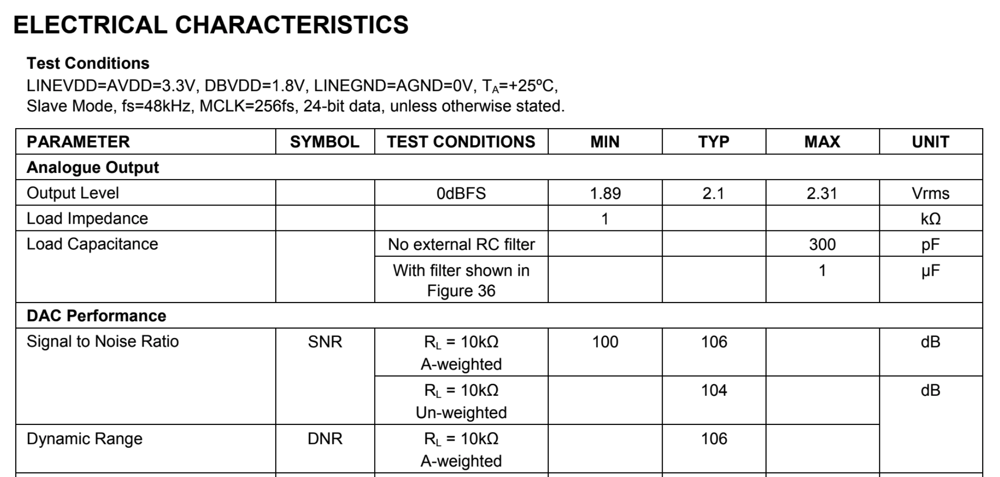
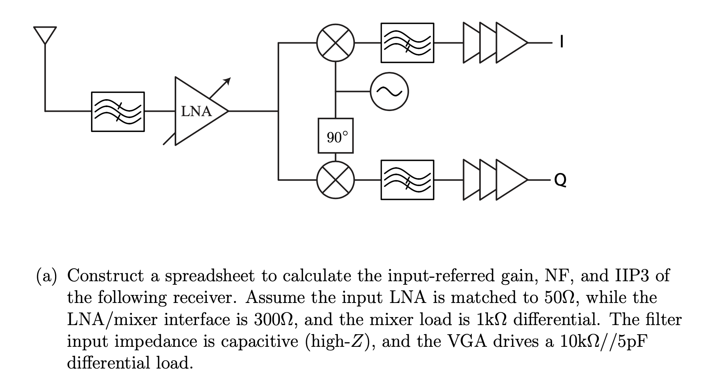
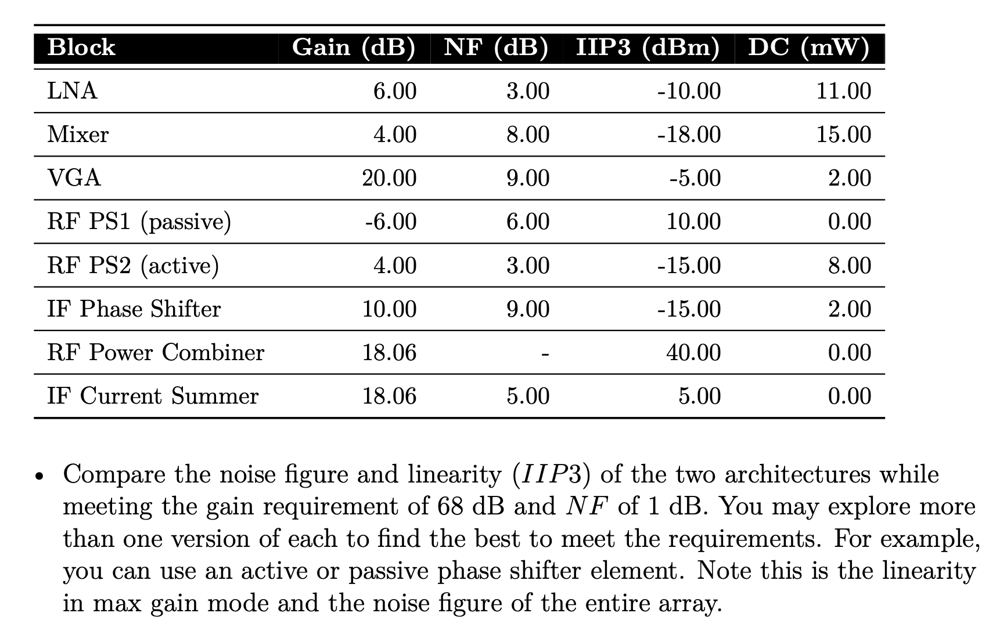
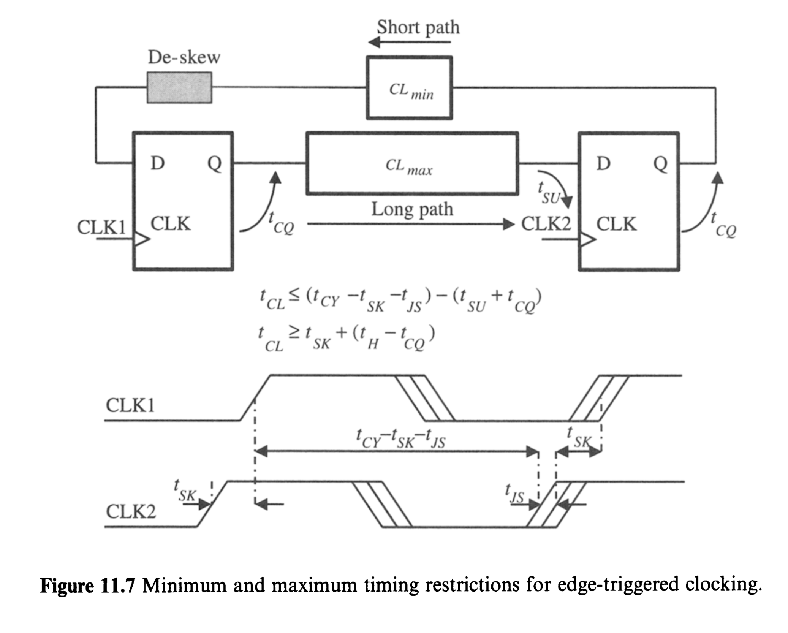

# Notes

## Hierarchical Design Flow Notes

We've seen big SoCs that include billions of transistors and thousands of human contributors. We've also seen that such chips include a wide diversity of tools and practices, varying between parts of the chip and phases of its design process. There is plenty of industry-specific alphabet-soup jargon to learn while getting comfortable with this process; first we'll spend a moment on *why* we have it in the first place. A lot of this is technical, but just as much is essentially sociological. C++ father Bjarne Stroustrup was famously quoted putting this like so:

*Coding is a human endeavor. Forget that and all is lost.*

That idea is just as effective should we replace *coding* with *designing* or *building*. We've got a big thing we want to make, far bigger than any one of us could hope to build on our own in an amount of time we'd care to build it. How do we divy up this task, both in people and in time? What technical infrastructure can we (or our predecessors) put forth to help in this task? 

<!--
To flesh out:

* Big system hierarchical division 
* People aligning with that hierarchy 
* Dependency graph between hierarchy 
* Time-sequence of what gets designed when
* Abstract reprs 
* Different representation domains 
* Hierarchical analysis 
-->


Effective divisions of this labor for complicated systems have generally arranged its sub-systems into a tree-like hierarchy. Parallelizing work on higher (closer to the root) layers of the tree generally requires they include some form of *abstract description* of lower layers. These design-abstracts include the necessary information for integrating and using a sub-system, without necessarily including all of its implementation details. These abstracts are also commonly divided among different *domains* or *disciplines*. Some of the important chip-design disciplines include:

* Parametric, e.g. performance specs
* Physical, e.g. layout 
* Behavioral 
* Timing 

The latter is specific to synchronous digital systems, of which our chip is (mostly) one. Its inclusion of a list at this high priority may seem out of place, and conceptually it may be. But static timing analysis is sufficiently integrated into our digital-compilation pipeline that we'll need to know about it, just about as importantly as we'll need to know about layout and Verilog. 

This list of disciplines can (and does) get quite a bit longer in practice. There are associated hierarchical models for testability, electromigration, power integrity, and just about any other domain-general chip-design quality-metric we can think of. This shorter list will be our focus. (Most of the longer list would be overkill for low-volume academic chips anyway.) 


### Parametric Specs

For non-integrated electronic systems, e.g. those built on PCBs, the primary abstract-description format is the datasheet. These have been around a long time; long enough to precede PDFs, or computers to render PDFs for that matter. Nowadays the datasheet typically comprises all of the abstract information in one bundled PDF file. (In prior days it did the same, just on typed paper.) One perennial component of those datasheets is the parametric spec-table, for instance: 




These spec-tables are probably how analog-brains most-commonly think of these abstract sub-systems. Sorting out how these sub-systems' parametric specs combine into larger-systems parametrics can be more of less straightforward. Power consumption serves as a super-simple example: a system with sub-systems A, B, and C consumes power equal to the linear sum of the powers consumed by A, B, and C. Other metrics combine with more difficulty. Those of you who have studied RF circuits have likely needed to compute some of these more elaborate combinations, such as for noise, linearity, and offset. 






*From A Niknejad's Advanced IC Design for Communications*


While those metrics combine with more difficulty than a linear sum, their combinations are at least analytically tractable. Many other such combinations are not, and require dedicated programs or simulation models to measure. 

In our IC designs, most systems fall in one of two categories. Either:

* The sub-system metrics are practically measurable, and the full-system metrics must be inferred from them, either analytically or with special-purpose models. The RF receive chain above and most other complex analog circuits fall in this category. Or, 
* The full-system metrics are practically measurable, but the sub-systems lack either (a) well-defined metrics of their own, or (b)  practical analytical relationships to the full-system metrics. Our CPU's execution-time when running a benchmark suite will fall into this category. In this case our analysis is not hierarchical, but occurs at "integration only" levels. 

With infinite capacity for computation at infinite speed, it'd be natural to perform every measurement of interest at the integration-level, and measure the performance of our system as it will appear in the lab. If we want to know whether the RF transceiver meets the BTLE spec, why not run a simulation of the full chain against the BTLE test spec? The answer is of course that in reality we lack that infinite compute capacity. We'll derive these system-metrics from a combination of sub-system measurements, spreadsheet-math, and simplified models instead. 

Notably, these sub-system parametrics generally do not feed into our chip-compilation pipeline. The remaining disciplines we'll cover, in contrast, are tightly integrated and required for it to run. 


### Abstract Layout and Its Typical Format, the LEF

An abstract layout has exactly the layout-content which a parent layout needs to know of it, and no more. This generally includes things like: 

* The cell's dimensions, shape, and outline 
* Its pins, their locations, metal layers, and sizes
* Some indication of where parent layouts may route through the internal volume of the block, versus where they may not

Our industry's overwhelmingly most-popular format for layout-abstracts is the Library Exchange Format, a spelled-out acronym you'll never hear again, because it's universally said and prounced LEF (like "laugh"). LEF is an ASCII text-format. It has a handful of scoped definition features, such as its own concept of a "library". For our discussion of hierarchical design and analysis, we're really most interested in its `module`-analogous concept, which LEF calls `MACRO`. We can find an example LEF `MACRO` in our ChipYard repository, representing the `ExampleDCO` used in past UCB-chips' PLLs. The `ExampleDCO` LEF-excerpt includes: 

* The module's outline via a `SIZE` attribute 
* Each of the module's (excerpted) `PINS`, including their metal layers and sizes
* A list of obstructions (`OBS`), through which it insists parent layouts may not add further metals

```
VERSION 5.6 ;
BUSBITCHARS "[]" ;
DIVIDERCHAR "/" ;

MACRO ExampleDCO
  CLASS BLOCK ;
  ORIGIN 0 0 ;
  FOREIGN ExampleDCO 0 0 ;
  SIZE 123.936 BY 125.536 ;
  SYMMETRY X Y ;
  PIN VDD
    DIRECTION INOUT ;
    USE POWER ;
    PORT 
      LAYER M5 ;
        RECT 3.024 121.536 3.8 125.536 ;
    END 
  END VDD
  PIN VSS
    DIRECTION INOUT ;
    USE GROUND ;
    PORT 
      LAYER M5 ;
        RECT 1.728 121.536 2.5 125.536 ;
    END 
  END VSS
  # ... 
  PIN sleep_b
    DIRECTION INPUT ;
    USE SIGNAL ;
    PORT 
      LAYER M4 ;
        RECT 0.0 45.312 1.2 45.696 ;
    END 
  END sleep_b
  PIN clock
    DIRECTION OUTPUT ;
    USE SIGNAL ;
    PORT 
      LAYER M4 ;
        RECT 122.736 0.384 123.936 0.768 ;
    END 
  END clock
  OBS 
    LAYER M1 ;
      RECT 1.2 0.0 122.736 121.536 ;
    LAYER M2 ;
      RECT 1.2 0.0 122.736 121.536 ;
    LAYER M3 ;
      RECT 1.2 0.0 122.736 121.536 ;
    LAYER M4 ;
      RECT 1.2 0.0 122.736 121.536 ;
    LAYER M5 ;
      RECT 1.2 0.0 122.736 121.536 ;
    LAYER M6 ;
      RECT 1.2 0.0 122.736 121.536 ;
    LAYER M7 ;
      RECT 1.2 0.0 122.736 121.536 ;
    LAYER M8 ;
      RECT 1.2 0.0 122.736 121.536 ;
    LAYER M9 ;
      RECT 1.2 0.0 122.736 121.536 ;
  END 
END ExampleDCO

END LIBRARY
```

### Abstract Timing and Its Typical Format, Liberty

Many of you will have seen static-timing analysis as a part of past digital circuits courses. It serves as a highly efficient means of verifying the physical-design of synchronous digital circuits, and is tightly integrated in a typical digital compilation pipeline. 



*Partovi, Clocked Storage Elements*

These Liberty models are often referred to as "libs" or "dot-libs", and generally have the file-suffix `.lib`. That name often invokes plenty of confusion, since it's just as likely to sound like a "library", either in the binary-program sense or in the collection-of-circuits-and-related-stuff sense we often use in IC design. 

Like LEF, Liberty is a text-based format. It has a handful of scoped definition features, such as its own concept of a "library". For our discussion of hierarchical design and analysis, we're really most interested in its `module`-analogous concept, which Liberty calls `cell`. A Liberty `cell` conceptually consists of:

* The cell's pins, and all timing relationships between each pin. 
    * For combinational logic paths, these generally take the form of delays, specified in semi-tabular format across variables such as loading and input slew rate.
    * For sequential pins and paths, these take the form of setup and hold constraints. These cells also generally include delay-style paths, for example from clock to output. 
* The capacitive load presented by each pin
* The power-supply domains of each pin, and 
* A handful of meta-information that will often help tools use the cell, or analyze larger blocks which use it. 
    * A common example is `leakage_power`, which expresses cell's idle-state power consumption in conditions dictated by a `when` clause. 

To our author's knowledge there is no publicly available, comprehensive documentation of the Liberty format. I certainly am not an expert on its details, and don't think I know anyone else who would claim to be such an expert either. Liberty's text-based format and highly-loose documentation makes it amenable (or prone) to both simple scripts generating and manipulating cells, and just as often, to those scripts screwing them up in ways overt and subtle. From-scratch LIBs are almost always generated by timing analysis tools, whether for standard-cell library characterization or larger cell-level characterization. 

The `AND2` below will server as our simple (ahem) example of a Liberty `cell`. You'll note it includes:

* `leakage_power` for each of its static states 
* Descriptions of each of its signal-pins, `A1`, `A2`, and `Z`
* The `pg_pins` and `power_down_functions` for each output pin 
* An (excerpted) list of `timing` paths in the `pin(Z)` section. The section labeled `related_pin: A1` describes the delay from `A1` to `Z`, including the table over two index-variables `index_1` and `index_2`, defined off-screen 


```
cell (AND2) {
  area : 0.4;
  pg_pin (VDD) {
    pg_type : primary_power;
  }
  pg_pin (VSS) {
    pg_type : primary_ground;
  }
  leakage_power () {
    value : 4.5;
    related_pg_pin : VDD;
  }
  leakage_power () {
    value : 2.0;
    when : "!A1 !A2 !Z";
    related_pg_pin : VDD;
  }
  leakage_power () {
    value : 5.0;
    when : "!A1 A2 !Z";
    related_pg_pin : VDD;
  }
  leakage_power () {
    value : 4.4;
    when : "A1 !A2 !Z";
    related_pg_pin : VDD;
  }
  leakage_power () {
    value : 6.4;
    when : "A1 A2 Z";
    related_pg_pin : VDD;
  }
  pin(A1) {
    direction : input;
    related_ground_pin : VSS;
    related_power_pin : VDD;
    capacitance : 0.000388307;
    rise_capacitance : 0.000388307;
    fall_capacitance : 0.000366013;
    internal_power () {
      when : "!A2&!Z";
      related_pg_pin : VDD;
      rise_power (passive_power_template_7x1_0) {
        index_1 ("0.0016, 0.0083, 0.0216, 0.0482, 0.1015, 0.2081, 0.4214");
        values ( \
          "-0.000169101, -0.000165176, -0.000168139, -0.000169215, -0.00017008, -0.000171007, -0.00017275" \
        );
      }
      fall_power (passive_power_template_7x1_0) {
        index_1 ("0.0016, 0.0083, 0.0216, 0.0482, 0.1015, 0.2081, 0.4214");
        values ( \
          "0.00024232, 0.000239247, 0.000241563, 0.000242498, 0.000242565, 0.000242863, 0.000242053" \
        );
      }
    }
  }
  pin(A2) {
    direction : input;
    related_ground_pin : VSS;
    related_power_pin : VDD;
    capacitance : 0.000448479;
    rise_capacitance : 0.000448479;
    fall_capacitance : 0.000428282;
    internal_power () {
      when : "!A1&!Z";
      related_pg_pin : VDD;
      rise_power (a_template_table_defined_elsewhere) {
        index_1 ("0.0016, 0.0083, 0.0216, 0.0482, 0.1015, 0.2081, 0.4214");
        values ( \
          "-0.000221115, -0.000217392, -0.000220049, -0.000221058, -0.000221394, -0.000221981, -0.000221396" \
        );
      }
      fall_power (passive_power_template_7x1_0) {
        index_1 ("0.0016, 0.0083, 0.0216, 0.0482, 0.1015, 0.2081, 0.4214");
        values ( \
          "0.000252858, 0.00023764, 0.000235796, 0.00023427, 0.000232813, 0.000231391, 0.000228648" \
        );
      }
    }
  }
  pin(Z) {
    direction : output;
    power_down_function : "!VDD + VSS";
    function : "(A1 A2)";
    related_ground_pin : VSS;
    related_power_pin : VDD;
    max_capacitance : 0.02642;
    timing () {
      related_pin : "A1";
      timing_sense : positive_unate;
      timing_type : combinational;
      cell_rise (a_template_table_defined_elsewhere) {
        index_1 ("0.0016, 0.0083, 0.0216, 0.0482, 0.1015, 0.2081, 0.4214");
        index_2 ("0.00012, 0.00054, 0.00138, 0.00305, 0.00639, 0.01306, 0.02642");
        values ( \
          "0.0117336, 0.0137303, 0.0170961, 0.0230851, 0.034629, 0.0574656, 0.103475", \
          "0.0133137, 0.0153002, 0.0186687, 0.0246761, 0.0362021, 0.0590866, 0.105057", \
          "0.0159362, 0.0179294, 0.021311, 0.0273291, 0.038871, 0.0617699, 0.107525", \
          "0.0191142, 0.0212184, 0.0246963, 0.0307626, 0.0423069, 0.0651475, 0.110877", \
          "0.0228423, 0.025173, 0.0289792, 0.0352166, 0.0467551, 0.0696063, 0.115304", \
          "0.027315, 0.0299445, 0.0342669, 0.0411978, 0.0531457, 0.0760411, 0.121886", \
          "0.0327368, 0.0358058, 0.0409214, 0.0490805, 0.0623833, 0.0862778, 0.132597" \
        );
      }
      // ... 
```

So this gets complicated fast. But nowhere near as fast as eschewing the hierarchical representations and attempting to close timing on billions of paths at once. 

Note the role of the process, temperature, and voltage conditions. SPICE-verified circuits can generally both (a) sweep the entire outer product of these conditions, and (b) expect their circuit peroformance to (usually) be relatively smooth functions of those conditions. Hierarchical timing descriptions, in contrast, generally enumerate each of a set of "PVTs", or conditions at which their cell libraries are characterized in simulation. 


---

A note on the origins of all these weird file-formats: our industry as it stands, and our partner EDA industry that generated most of this stuff, really grew into its current state in the 1980s. Creating custom text-based file-formats was cool then, I guess. As must have been writing custom parsers for them, and validators, and all. This was before the software industry collectively realized this was a pretty big waste of everyone's time, and put all the data being shipped around the web into JSON, and all the configuration being shipped around the industry into YAML, TOML, and a few other markup-languages. It was before the prior revolution which decided the same thing, but instead put it all into more verbose XML. 

So virtually every other file has its own self-defined, ill-documented, ASCII-based schema. For example the files which map GDS layers to their purpose and description will look something like: 

```
DIEAREA ALL 100  0

M1     LEFPIN,LEFOBS,PIN,NET,SPNET,VIA 31       0
# ...
M9     LEFPIN,LEFOBS,PIN,NET,SPNET,VIA 39       60
M1     VIAFILL,FILL            31    1
# ...
M9     FILL            39    61
# ...
# ... (note these "comments" aren't actually supported)
# ...
VIA1     LEFPIN,LEFOBS,VIA   51       0
VIA1     VIAFILL         51    1
NAME     M1/PIN          131    0
```

And they will have a typical file-extension of: nothing. Such is your lot in life; complain about it, or do something about it. 

---

### Implications for Building Hierarchical Stuff 

Unlike the parametric-spec abstracts, those for behavior, physical layout, and timing generally are included in the compilation pipeline for every layer of hierarchy above them. Each of the primary digital construction tools uses some combination of them while inline-analyzing its input and producing its ultimate output. 

The abstract views for timing, layout, and behavior also have a lot of information in common, which generally must be self-consistent between them for any of these tools to coherently work. Particularly, all three include each module's port list. Setting these port-interfaces and their behavior then becomes a crucial early task for a hierarchical design process. In contrast to a bottom-up process in which parametric specs drive leaf cells, which drive their parents (both internally and at their interfaces), a hierarchical process requires definition of each sub-system's abstract views, generally in this order:

1. Interface 
2. Behavior 
3. Layout
4. Timing 

The early requirements for interfaces and behavior also aligns with a mixed-signal chip-style, in which a set of digital logic configures and collaborates with a set of deeper-nested analog circuitry. Settings, configuration registers, calibration steps, and the like appear "from thin air" in MATLAB and similar models of these blocks, but typically require someone, often someone else, to design into silicon. 

This course's design process won't adopt the full ten-billion-transistor flow, but will be hierarchical. So we'll need a similar set of priorities to enable upper-layers and lower-layers to work in parallel: define interfaces and behavior early, and implement against them to follow. 


